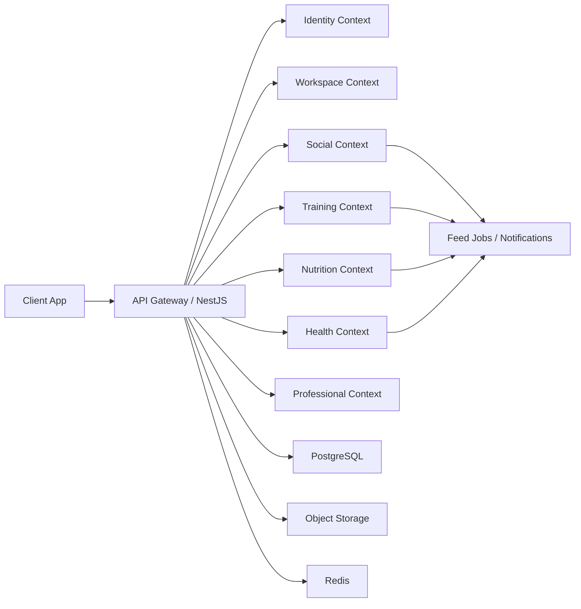

# Target Architecture

## High-Level Architecture

Momentum V2 should remain a modular monorepo, but the domain model must shift from a habit tracker to a platform architecture.

Recommended runtime model:

- `momentum-client`: Next.js application
- `momentum-server`: NestJS modular API
- PostgreSQL for relational product data
- object storage for media and attachments
- Redis for queues, cache, sessions, rate limiting, and real-time coordination
- background workers for notifications, feed fan-out, imports, analytics jobs

## Architectural Transition

Current structure:

- users
- teams
- challenges
- habits
- habit logs
- posts
- one team chat

Target structure:

- identity and profile
- workspaces and memberships
- channels and messaging
- social graph and feed
- goals, programs, and challenges
- workouts
- nutrition
- health and biometrics
- professionals and client relationships
- notifications and integrations

## Bounded Contexts

### Identity Context

Responsible for:

- authentication
- passkeys and sessions
- profile data
- privacy settings
- user preferences

### Workspace Context

Responsible for:

- workspaces
- memberships
- custom roles
- permissions
- invitations
- moderation

### Messaging Context

Responsible for:

- channels
- direct messages
- message attachments
- moderation actions
- read state

### Social Context

Responsible for:

- feed items
- comments
- reactions
- follows
- public profiles
- events

### Program Context

Responsible for:

- challenges
- goals
- habits
- recurring plans
- team programs

### Training Context

Responsible for:

- workout templates
- workout plans
- workout sessions
- exercises
- sets and metrics

### Nutrition Context

Responsible for:

- meals
- meal logs
- macro targets
- hydration
- nutrition plans

### Health Context

Responsible for:

- body metrics
- biometric metrics
- sleep
- steps
- heart rate
- device imports

### Professional Context

Responsible for:

- coach profiles
- nutritionist profiles
- client assignments
- reviews
- check-ins

### Notification Context

Responsible for:

- in-app notifications
- email digests
- push notifications
- reminder jobs

## Recommended Backend Module Map

```text
src/modules
  auth
  identity
  profiles
  workspaces
  roles
  permissions
  memberships
  channels
  messaging
  feed
  reactions
  comments
  follows
  programs
  habits
  habit-logs
  workouts
  workout-templates
  nutrition
  health
  biometrics
  professionals
  check-ins
  notifications
  integrations
  analytics
  storage
  ai-assistant
```

## Recommended Frontend Product Areas

```text
app
  (marketing)
  (auth)
  (app)
    home
    feed
    explore
    workspaces
    workouts
    nutrition
    health
    goals
    profile
    inbox
    settings
    pro
```

## Data Flow



## Real-Time Requirements

The current codebase does not have a real-time layer. V2 should add one for:

- channel messaging
- message delivery status
- notification counts
- live event rooms
- collaborative presence in selected spaces

Recommended transport:

- WebSocket gateway for authenticated real-time features
- event-driven notification publishing from domain services

## Event-Driven Operations

The following actions should emit internal domain events:

- membership created
- role assigned
- channel created
- message sent
- workout session completed
- meal logged
- biometric metric imported
- client check-in submitted
- post or activity published

These events should feed:

- notifications
- feed creation
- analytics aggregation
- AI insights pipelines

## Reuse Strategy For Existing Models

### Reuse directly

- `User`
- `Session`
- file storage
- current team membership as an initial base for workspace membership
- user settings as a flexible preferences bucket

### Refactor heavily

- `Team` into `Workspace`
- `Chat` into `Channel`
- `Post` into a richer `FeedItem` model
- role enum into RBAC

### Keep separate

- `Habit` should remain lightweight and not become a generic workout or meal entity

## Architecture Decisions

1. Keep monolith deployment early, but separate contexts inside the codebase.
2. Use PostgreSQL as the source of truth for structured product data.
3. Introduce Redis before advanced social and messaging features.
4. Prefer internal domain events over direct cross-module calls for feed and notification side effects.
5. Keep AI assistant as a consumer of normalized domain data, not as the source of truth.
