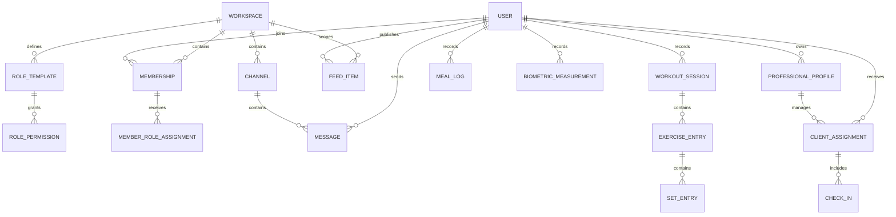

# Domain Model

## Domain Model Goals

The data model must support:

- solo and group usage
- private and public activity
- structured training and nutrition data
- role-based collaboration
- expert-client relationships
- future integrations

## Core Domain Aggregates

### User

Represents a human account in the system.

Fields:

- id
- email
- password hash or passkey linkage
- nickname and public profile data
- avatar and header media
- locale and timezone
- visibility defaults
- account status

### Workspace

Represents a shared space for a team, club, cohort, or expert-led group.

Fields:

- id
- slug
- name
- description
- type: `team`, `club`, `program`, `private-group`
- visibility: `public`, `private`, `discoverable`
- branding assets
- owner id
- moderation settings

### Membership

Represents a user inside a workspace.

Fields:

- workspace id
- user id
- status
- joined at
- blocked at
- invitation source

### Role and Permission

Represents customizable access logic inside a workspace.

Role fields:

- id
- workspace id
- name
- system flag
- priority

Permission fields:

- code
- resource
- action

### Channel

Represents a communication stream inside a workspace.

Fields:

- workspace id
- type: `general`, `announcement`, `topic`, `private`, `direct`
- name
- description
- visibility
- posting permissions

### FeedItem

Represents content shown in feeds.

A feed item is a wrapper entity. The actual subject can be:

- text post
- workout activity
- meal share
- progress update
- event announcement
- coach note
- challenge result

Fields:

- actor id
- workspace id optional
- subject type
- subject id
- visibility
- published at
- counters

### Challenge

Represents a competitive or collaborative structured program.

Fields:

- workspace id optional
- title
- description
- type: `habit`, `activity`, `nutrition`, `hybrid`
- scoring model
- participant scope
- schedule

### Habit

Represents a recurring action with low complexity.

Examples:

- drink water
- sleep before 23:00
- stretch 10 minutes
- walk 10k steps

This entity must not be stretched to cover all workout structures.

### Workout Session

Represents one executed training activity.

Fields:

- user id
- workspace id optional
- plan id optional
- template id optional
- sport type
- started at
- ended at
- duration
- effort rating
- calories
- notes
- visibility

### Exercise Entry

Represents an exercise inside a workout session.

Fields:

- workout session id
- exercise id
- order
- metrics type

### Set Entry

Represents a set or interval with structured performance data.

Possible metrics:

- reps
- weight
- distance
- duration
- pace
- heart rate

### Meal Log

Represents a meal or food intake event.

Fields:

- user id
- workspace id optional
- meal type
- eaten at
- calories
- protein
- carbs
- fat
- fiber
- water estimate
- notes
- photo

### Nutrition Plan

Represents assigned nutrition rules or templates.

Fields:

- assigned by
- assigned to
- daily targets
- restrictions
- schedule
- adherence rules

### Biometric Measurement

Represents a time-based health or body metric.

Types may include:

- weight
- body fat
- waist
- resting heart rate
- heart rate variability
- sleep duration
- steps
- active energy

### Professional Profile

Represents a user acting as a coach or nutrition expert.

Fields:

- user id
- role type
- specialization
- bio
- pricing optional
- certification metadata
- availability

### Client Assignment

Represents a professional relationship.

Fields:

- professional id
- client id
- scope: `training`, `nutrition`, `hybrid`
- status
- private notes
- permissions granted by client

### Check-In

Represents a recurring review submission from a client.

Fields:

- assignment id
- submitted by
- period start and end
- subjective answers
- weight and body metrics snapshot
- adherence scores
- attachments

## Conceptual Relationship Diagram

## Proposed Database Evolution

### Existing tables to preserve

- users
- sessions
- user_settings
- storage-related objects

### Existing tables to migrate or rename conceptually

- teams -> workspaces
- team_members -> memberships
- chats -> channels
- messages -> channel_messages
- posts -> feed items plus feed subjects

### New tables required

- role_templates
- permissions
- role_permissions
- member_role_assignments
- channels
- channel_members
- message_reads
- feed_items
- comments
- reactions
- follows
- workout_templates
- workout_sessions
- exercise_entries
- set_entries
- meals
- meal_items
- nutrition_plans
- biometric_measurements
- health_connections
- professional_profiles
- client_assignments
- check_ins
- notifications

## Visibility Model

Each activity-like entity should carry visibility:

- `private`
- `workspace`
- `followers`
- `public`

This applies to:

- feed items
- workouts
- meals when shared
- selected health summaries

Raw biometric values should default to `private`.

## Data Ownership Rules

1. Users own their personal health and activity data.
2. Workspace-scoped shared content belongs to the workspace but references the author.
3. Professional notes can be visible only to the professional and explicitly authorized staff.
4. Client health data must never become visible to workspace members by default.
